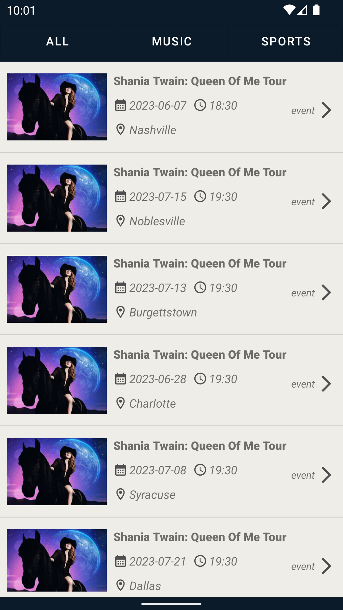
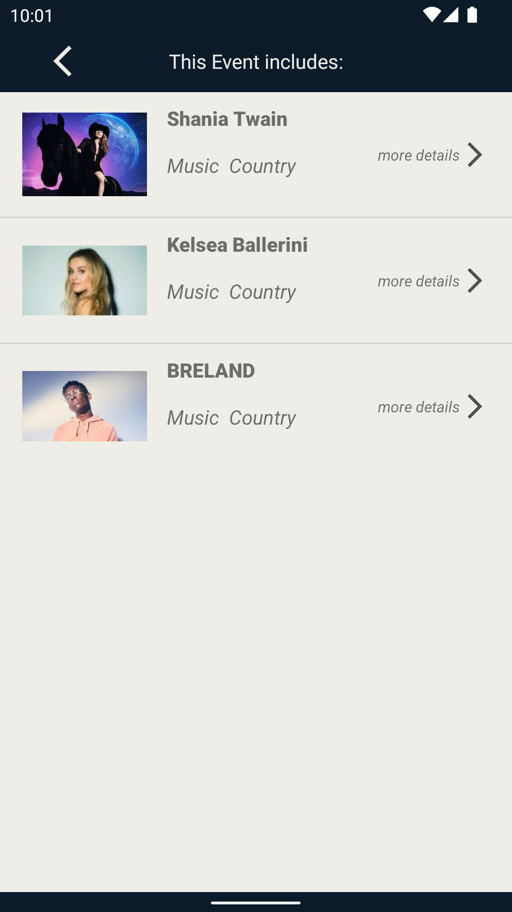
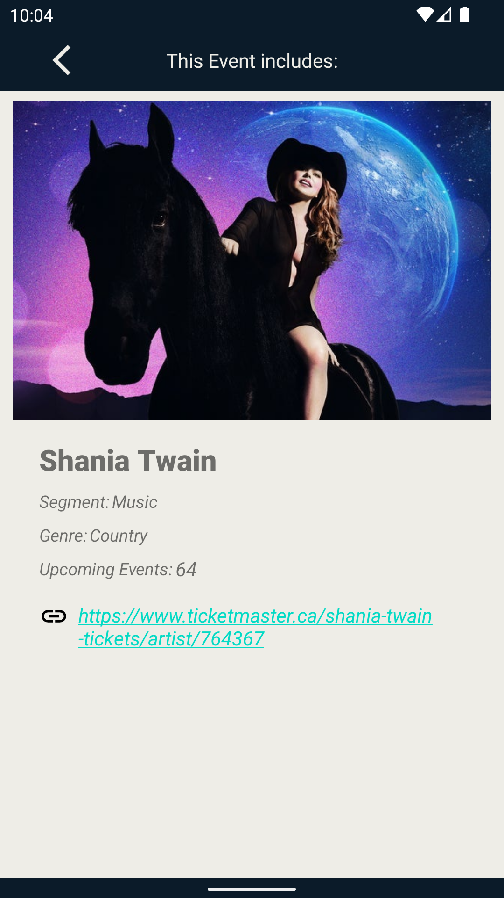
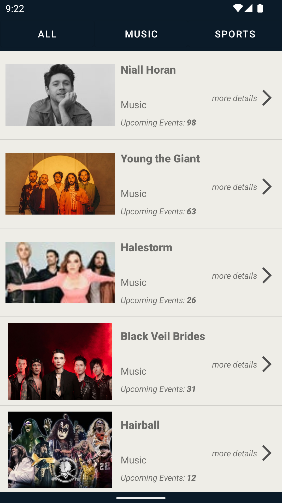
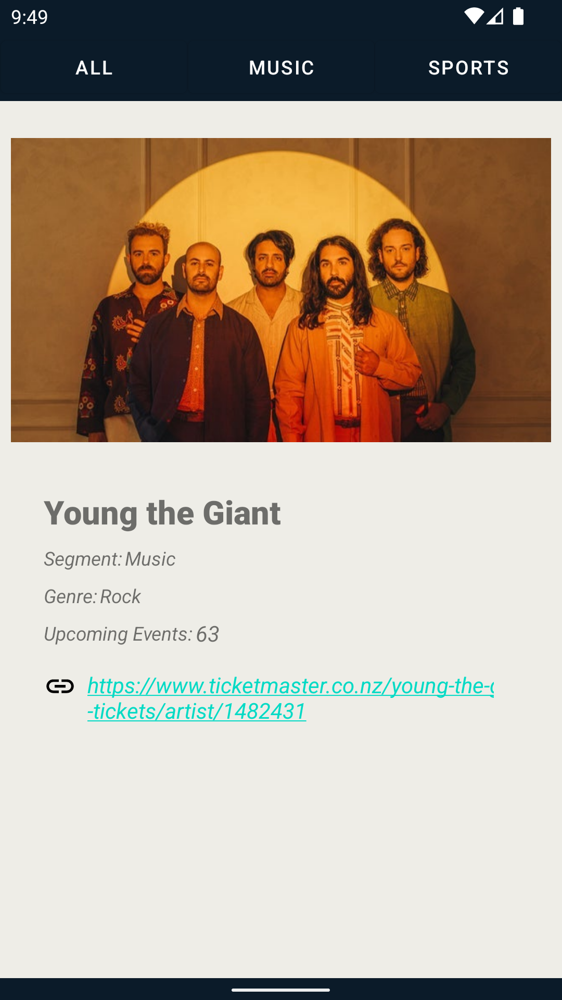

# Web API | Ticketmaster :ticket:

 


<p>This Ticketmaster API allows you to search for events, attractions, or venues.</p>
<p>This is a very simple app that pulls ticketmaster data from a web server and decode that data from JSON format with gson which is a google plugin.
  The data is converted from JSON into our kotlin object and then displayed in some text views.<p>

## Authentication :key:
To run a successful API call, you will need to pass your API Key in the apikey query parameter. <strong>Your API Key should automatically appear in all URLs throughout this portal.</strong>

<strong>Example:</strong> https://app.ticketmaster.com/discovery/v2/events.json?apikey=VOHtOfw37AJt3mvrD4VHV80sVG8oecph
<p>Without a valid API Key, you will receive a ${\color{red}401}$ Status Code with the following response:</p>

```json
{
    "fault": {
        "faultstring": "Invalid ApiKey",
        "detail": {
            "errorcode": "oauth.v2.InvalidApiKey"
        }
    }
}
```

<strong>Root URL: </strong>
https://app.ticketmaster.com/discovery/v2/


## Overview on my channel Youtube :point_down:

https://www.youtube.com/watch?v=8Iu8v1yeIV0&ab_channel=HichamAf <br>

| All Events | Event | More details |
| ------------- | ------------- | ------------- |
|  |  |  |

| All Music Events | More details |
| ------------- | ------------- |
|  |  |
